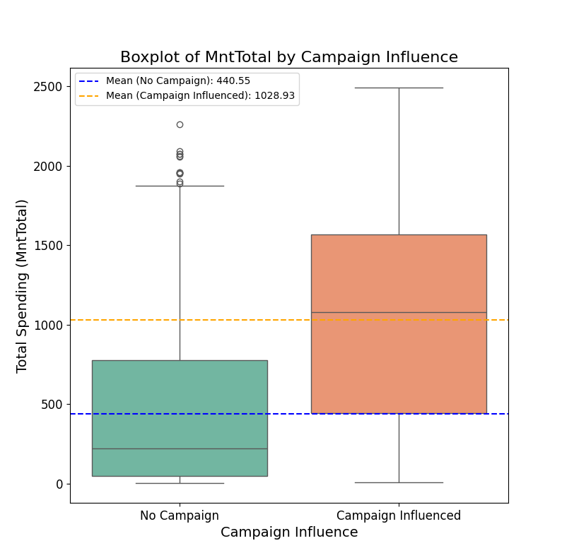

# 📦 Marketing Campaign Impact Analysis

This project analyzes how marketing campaign acceptance affects customer spending using a retail dataset. It was completed as part of my Data Analytics elective in the BSCpE program at Cavite State University – Main Campus.

## 🎯 Objective

To determine if there's a significant difference in **total spending (`MntTotal`)** between:
- Customers who **did not accept** any marketing campaigns
- Customers who **accepted** one or more campaigns

## 📊 Dataset Overview

The dataset includes customer information such as:
- Spending across different product categories (e.g., wine, meat, fish)
- Campaign responses (`AcceptedCmp1` to `AcceptedCmp5`, `AcceptedCmpOverall`)
- Purchase behavior (web, catalog, store)
- Demographics (age, education, marital status)

**Target variable for analysis:**  
- `MntTotal` → total customer spending

**Segmentation column used:**  
- `AcceptedCmpOverall`  
  - `0` = No campaign accepted  
  - `>0` = One or more campaigns accepted

## 🔬 Methodology

- **Data Segmentation** into two groups (Campaign vs. No Campaign)
- **Independent t-test** using `scipy.stats` to compare means
- **Boxplot Visualization** using `seaborn`
- Interpretation of statistical significance (p-value threshold: 0.05)

## 📈 Visualization

A boxplot was used to compare the spending distribution:

Horizontal lines indicate the average spending per group:
- 🟠 Campaign Influenced
- 🔵 No Campaign

## 🧪 Results

| Metric | Value |
|--------|-------|
| T-statistic | (shown in script output) |
| P-value     | (shown in script output) |

### Interpretation:
- If **p-value < 0.05** → There's a statistically significant difference in spending between groups.
- If **p-value ≥ 0.05** → No significant difference observed.

## 💻 Technologies Used

- Python
- pandas
- seaborn
- matplotlib
- scipy

## 🧑‍🎓 Academic Context

This is a hands-on academic project for my **Data Analytics elective** as a **3rd-year BS Computer Engineering student**. It demonstrates skills in:

- Exploratory Data Analysis (EDA)
- Statistical inference
- Data visualization
- Real-world data application

---

### ✅ Feel free to explore, reuse, or reach out for collaboration!

